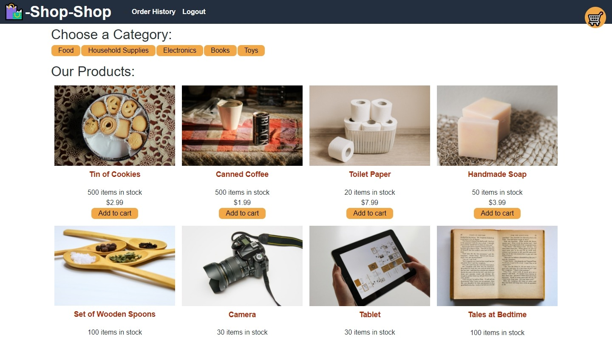

# Shop-Shop

## Description
Shop-Shop is an e-commerce platform built using React technology. It originally used prop drilling to manage state, but it was adapted to use React Context, and then later to use Redux. Other notable features are the usage of Stripe to handle customer payments and offline functionality using IndexedDB.

## Table of Contents
* [Description](#Description)
* [Installation](#Installation)
* [Usage](#Usage)
* [License](#License)
* [Tests](#Tests)
* [Credits](#Credits)

## Installation
* Clone the repository, navigate to the repository in the commandline, and run `npm i`.
 * To seed the database, run the command `npm run seed` in the root folder.
 * Run `npm start` to start the app.
 * Checkout other scripts in the package.json in the root folder.

## Usage
* On the homepage, click an item you are interested in learning more about or click the `Add to cart` button beneath it to add it to your cart. You may also sort by category.
 * On the single product page, you can add or increase the quantity of the item to your cart with the `Add to Cart` button or remove it with the `Remove from Cart` button.
 * In the cart menu, you can change the quantity of the items in your cart using the input box, or remove the item by clicking the trash icon.
 * Signup or login to check out your items.
 * After login, you can click the `check out` button in the cart menu to check out.
 * On the Stripe payment page, use the card number `4242 4242 4242 4242` to simulate a successful payment (see [Stripe documentation](https://stripe.com/docs/testing)). Other details do not matter.
 * Wait to be navigated back to the homepage.
 * Your order can now be found in the Order History page (see navbar).

## License
Licensed under the [MIT](./LICENSE) license.

## Tests
Tests are written using jest for the Redux reducers. Use the command `npm test` in the client folder to test.

## Credits
Coded by [ZQWhiting](https://github.com/ZQWhiting).

 Starter code provided by the University of Utah Online Coding Bootcamp.

Check out my [portfolio](https://zqwhiting.github.io/react-portfolio/)!